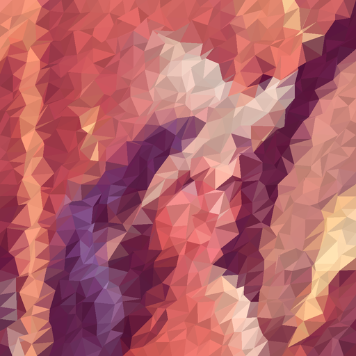

# lowpoly

 A simple and inefficient low-polygon image generator 
 
## Examples

Original                                  |Lowpoly
:----------------------------------------:|:------------------------------------------------:
 | 

## Usage
```
usage: lowpoly [-h] [-dx density] [-dy density] [-a aascale] [-w wiggle] [-cd colordev] [-s scale]
               input_img output_img

Lowpolyfy an image.

positional arguments:
  input_img             input image (at least 2x2)
  output_img            output image name

optional arguments:
  -h, --help            show this help message and exit
  -dx density, --densityx density
                        number of grid points along X axis
  -dy density, --densityy density
                        number of grid points along Y axis
  -a aascale, --antialias aascale
                        antialias scale factor
  -w wiggle, --wiggle wiggle
                        random grid wiggle magnitude (pixel)
  -cd colordev, --colordev colordev
                        random color brightness deviation (percentage)
  -s scale, --scale scale
                        output image scale factor

```
